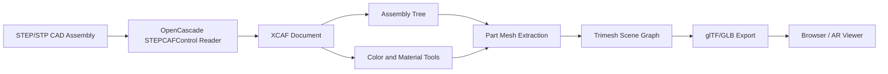
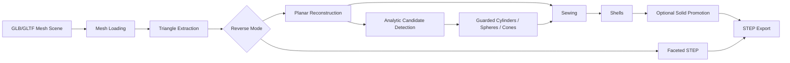
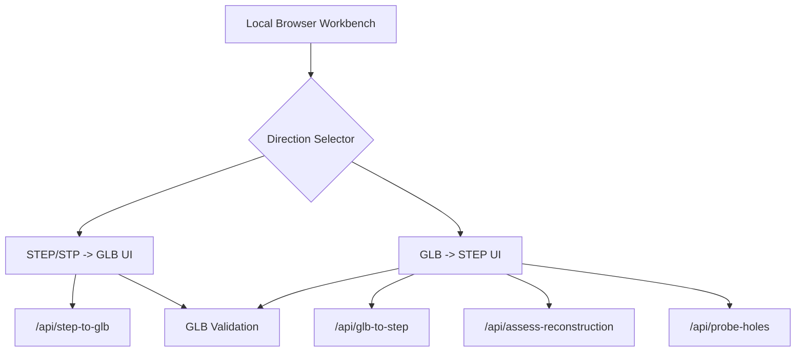

# Architecture

CADConverter has two related pipelines that share a local workbench and validation layer.

## Forward Pipeline: STEP/STP To GLB

The forward path is designed for browser and AR viewing. It avoids flattening a CAD assembly into one mesh by reading the STEP file through OpenCascade XCAF metadata.

Key ideas:

- Free shapes become scene roots.
- Assemblies and subassemblies become parent nodes.
- Leaf parts become mesh nodes.
- Reused part definitions can be instanced through scene transforms.
- STEP colors and available visual materials are mapped to glTF materials.
- Geometry is scaled from CAD millimeters to glTF meters.
- Double-sided materials can be forced for thin CAD surfaces and web viewers.

## Reverse Pipeline: GLB/GLTF To STEP

The reverse path starts from triangles, not original CAD features. That makes it an inference problem rather than a true native-CAD translation.

Reverse modes:

- `faceted`: exports one STEP face per mesh triangle. This is the most literal and reliable fallback, but it creates large mesh-like STEP files.
- `reconstructed`: merges connected coplanar triangles into larger planar STEP faces, then uses OpenCascade sewing to build connected shell topology.
- `advanced`: uses reconstructed mode plus guarded analytic primitive recovery and solid promotion where safe.

Guarded recovery currently includes:

- analytic cylinder candidates
- complete sphere recovery
- complete cone/frustum recovery
- closed-shell solid promotion
- isolated planar hole probing

## Workbench Layer

The workbench runs locally through Python's HTTP server stack. It is intentionally file-folder based: it lists STEP/STP and GLB/GLTF files from the selected workbench directory and writes outputs back into that directory.

Important endpoints:

- `GET /api/steps`: list STEP/STP inputs.
- `GET /api/glbs`: list GLB/GLTF inputs.
- `GET /api/validate?file=...`: validate a GLB.
- `POST /api/step-to-glb`: forward conversion.
- `POST /api/glb-to-step`: reverse conversion.
- `POST /api/assess-reconstruction`: compare reverse modes.
- `POST /api/probe-holes`: run risky hole reconstruction in an isolated child process.

## Failure Boundaries

OpenCascade is a native library, so certain invalid or complex topology operations can terminate the Python process with an access violation. The project treats those paths carefully:

- Simple forward STEP-to-GLB meshing runs in-process.
- Standard GLB-to-STEP reconstruction uses conservative guards.
- Experimental hole reconstruction can be tested in a child process through `probe-holes`.
- Complex hole loops are skipped by default before OpenCascade face construction.

## Known Limits

- Native CAD design intent is not recoverable from GLB triangles.
- Feature history, sketches, constraints, and parametric dimensions are not reconstructed.
- Fillet and freeform NURBS recovery are not implemented.
- Native proprietary CAD formats are not directly supported.
- STEP quality depends on what the source exporter includes.
